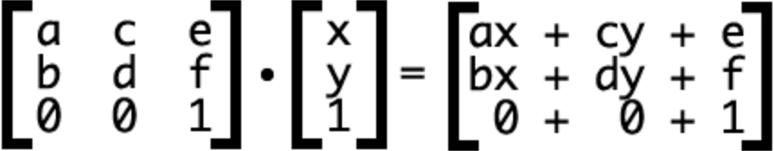

## background
```
// 背景色设置
bg:-webkit-gradient(linear, 0 0, 0 100%, from(#fff), to(#ccc));上下
bg:-webkit-gradient(linear, 0 100%, 0 0, from(#fff), to(#ccc));下上
bg:-webkit-gradient(linear, 100% 0, 0 0, from(#fff), to(#ccc));右左
bg:-webkit-gradient(linear, 0 0, 100% 0, from(#fff), to(#ccc));左右

bg:-moz-linear-gradient(top, #fff,#ccc);
bg:-moz-linear-gradient(center bottom, #fff,#ccc);
bg:-moz-linear-gradient(left, #fff,#ccc);
bg:-moz-linear-gradient(right, #fff,#ccc);

bg-image:linear-gradient(90deg, #1cf7ff, #ff1c7c); /*左右*/
bg-image:linear-gradient(top, red 0%, yellow 50%, blue 100%);/*上下*/
bg-image:linear-gradient(top left, red 0%, yellow 50%, blue 100%);
background-image: linear-gradient(260deg, #e9ebf8, #adaec6);

// 控制背景图片大小 10px 10px
background-size: cover

// 保持背景图片的宽高比
background-size:contain

background-origin: content-box、padding-box 或 border-box;背景图
border;从border边框位置算起
padding;从padding位置算起
content;从content-box内容区域位置算起；

background-clip: 
content-box、padding-box 或 border-box;背景色
border;背景在border边框下开始显示
padding;背景在padding下开始显示
content;背景在内容区域下开始显示
no-clip;默认属性值，类似与background-clip: border;

background-break:
continuous;此属性是默认值，忽视区域之间的间隔空隙（给它们应用图片就好像把它们看成一个区域一样）
bounding-box;重新考虑区域之间的间隔
each-box;对每一个独立的标签区域进行背景的重新划分
```

## transfrom
```
角度   rotateX( -5deg )
倾斜   skew( 20deg,20deg )
比例   scale( 2.0 )
位移   translateY( -5deg )
链式   transform: rotate(20deg) skew(-10deg) scale(3.0) translate(100px,0);
改变元素基点 transform-origin: left top; //默认中心点开始变形

transform: matrix(1, 0, 0, 1, 30, 30)/* a=1, b=0, c=0, d=1, e=30, f=30 */
```
##### 消除transition闪屏
```
-webkit-transform-style: preserve-3d;
-webkit-backface-visibility: hidden;
-webkit-perspective: 1000;
```

###### 硬件加速
```
-webkit-transform: translate3d(0,0,0)
-moz-transform: translate3d(0,0,0)
-ms-transform: translate3d(0,0,0)
transform: translate3d(0,0,0)
```


```
transform: matrix(2, 0, 0, 2, 30, 30); a=1, b=0, c=0, d=1, e=30, f=30
matrix(缩放X, 0, 0, 缩放Y, x坐标, y坐标)
transform-style:
flat 子元素将保留其3d位置
preserve-3d 不保留
el.style.transformStyle = flat
```

## transition
```
属性
过渡性质    transition-property：height;
过渡时间    transition-duration：.3s;
延迟时间    transition-delay：0；
过渡类型    transition-timing-function：ease;

过渡类型
逐渐变慢          ease (加速)
匀速             linear
加速             ease-in
减速             ease-out
加速然后减速      ease-in-out
自定义          cubic-bezier [0,0],[1,1]x1,x2,y1,y2  

// 兼容性
transition-property:width;
-moz-transition-property: width; /* Firefox 4 */
-webkit-transition-property:width; /* Safari 和 Chrome */
-o-transition-property:width; /* Opera */

// 实例
transitiontext-shadow 1s linear .5s；//第二个动画延迟0.5s;
or
transition:1s 2s height cubic-bezier(.83,.97,.05,1.44); //延迟两秒执行

// js设置
div.style.webkitTransitionProperty = '-webkit-transform’;
div.style.webkitTransitionTimingFunction = 'cubic-bezier(0, 0, 0.2, 1)’;

// 事件
webkitTransitionEnd
transition动画执行结束,会触发webkitTransition事件
webkitAnimationEnd事件只在元素向右移动,然后向左返回之后触发一次,而webkitTransitionEnd事件将在元素向右移动之后触发一次,在元素向左返回之后再触发一次

http://www.ruanyifeng.com/blog/2014/02/css_transition_and_animation.html
```

## animate
```
属性
animation-name: rainbow;
animation-duration: 1s;
animation-timing-function: linear;
animation-delay: 1s;
animation-fill-mode:forwards;
animation-direction: normal;
animation-iteration-count: 3;
animation: 1s 1s rainbow linear 3 forwards normal;

animation-name                    名称
animation-duration                播放时间,默认0   
animation-timing-function         播放方式,默认ease   
animation-delay                   动画何时开始,默认0
animation-iteration-count         循环的次数n,infinite代表无限,默认1
animation-direction               默认是normal，alternate则第偶数次向前播放，奇数次向反方向播放
animation-play-state              是否运行或暂停,默认running
animation-fill-mode               动画时间之外的状态
animation: myfirst 5s linear 2s infinite alternate;

@keyframes myfirst{
0%   {background: red;}
25%  {background: yellow;}
50%  {background: blue;}
100% {background: green;}
}

事件
-webkit-animation动画其实有三个事件： 
开始事件 webkitAnimationStart 
结束事件 webkitAnimationEnd 
重复运动事件 webkitAnimationIteration

方法
animation: 1s name infinite; // 播放时间 播放类名 无线循环
animation: 1s name forwards; // 停留在最后一帧  backwards回到第一帧

@keyframes pound {
  from，to { transform: none; }
  50% { transform: scale(1.2); }   // 1turn = 360deg
}

打印机效果
h1 {
  font: bold 200% Consolas, Monaco, monospace;
  border-right: .1em solid;
  width: 16.5em; /* fallback */
  width: 30ch; /* # of chars */
  margin: 2em 1em;
  white-space: nowrap;
  overflow: hidden;
  animation: typing 20s steps(30, end),
    blink-caret .5s step-end infinite alternate;
}
@keyframes typing { from { width: 0; } }
@keyframes blink-caret { 50% { border-color: transparent; } }
```

## selector
```
属性选择器
a[href^="http://“]
a[href^="png“]
a[class^=‘a']开头
a[class$=‘a']结束
a[class~=‘a']
a[class*=‘a']包含
input[type='text’]
input:checked

伪类选择器
p:before{content:之前} 
p:after{content:之后}
p:nth-child(n){}
p:first-child
p:last-child
odd基数2n+1
even偶数2n+0,2n
2-父级下第二个子元素是P标签时匹配
2n-除了P标签还有别的标签则匹配基数P标签，否则就是偶数
3n+1-同上匹配1,4.7，否则3，6，9

p:nth-last-child(n){}
最后一个子元素算起,类似nth-child

div p:first-child{}
父级下第一个子元素为p标签时匹配，对应last-child

div p:first-of-type{}
父级下同类型中第一个p标签，对应last-of-type

p:nth-of-type(n){}
匹配指定的标签为一个合集,类似nth-child （不一定是相同的元素）

p:nth-last-of-type(n){}
选择指定类型的元素，从元素的最后一个开始计算

p:only-child{}
父类下只剩下一个P元素

p:only-of-type(){}
没有同类型的相同元素

p:empty
为空

p~p{}
相邻的都是p标签时

#box *:not(h1){}
li:not(.first-item):not(:last-of-type)
如果想对某个结构元素使用样式，但是又想排除这个元素下面的某个子元素，让它不使用此样式 

h1 + p {color:#ddd;}
选择紧接在h1元素后出现的p元素

默认选中样式
::selection { background:#d3d3d3; color:#555; }
::-moz-selection { background:#d3d3d3; color:#555; }
::-webkit-selection { background:#d3d3d3; color:#555; }

select去掉三角
input::-webkit-outer-spin-button,
input::-webkit-inner-spin-button {
    -webkit-appearance: none !important;
    margin: 0;
}

div > * :not(:first-child) {
  margin-left:10px
}
```


## object-fit
```css

```


##### 去掉点击元素产生背景或者边框
```
// ios用户点击一个链接，会出现一个半透明灰色遮罩, 如果想要禁用，可设置-webkit-tap-highlight-color的alpha值为0去除灰色半透明遮罩；
// android用户点击一个链接，会出现一个边框或者半透明灰色遮罩, 不同生产商定义出来额效果不一样，可设置-webkit-tap-highlight-color的alpha值为0去除部分机器自带的效果；
// winphone系统,点击标签产生的灰色半透明背景，能通过设置<meta name="msapplication-tap-highlight" content="no">去掉；
// 特殊说明：有些机型去除不了，如小米2。对于按钮类还有个办法，不使用a或者input标签，直接用div标签
a,button,input,textarea {
    -webkit-tap-highlight-color: rgba(0,0,0,0);
    -webkit-user-modify:read-write-plaintext-only; //-webkit-user-modify有个副作用，就是输入法不再能够输入多个字符
}
// 也可以
* { -webkit-tap-highlight-color: rgba(0,0,0,0); }
// winphone下
<meta name="msapplication-tap-highlight" content="no">
```

###### 美化表单
```
// 一、使用appearance改变webkit浏览器的默认外观
input,select { -webkit-appearance:none; appearance: none; }

// 二、winphone下，使用伪元素改变表单元素默认外观
//1.禁用select默认箭头，::-ms-expand修改表单控件下拉箭头，设置隐藏并使用背景图片来修饰
select::-ms-expand { display:none; }

// 2.禁用radio和checkbox默认样式，::-ms-check修改表单复选框或单选框默认图标，设置隐藏并使用背景图片来修饰
input[type=radio]::-ms-check,
input[type=checkbox]::-ms-check { display:none; }

// 3.禁用pc端表单输入框默认清除按钮，::-ms-clear修改清除按钮，设置隐藏并使用背景图片来修饰
input[type=text]::-ms-clear,
input[type=tel]::-ms-clear,
input[type=number]::-ms-clear { display:none; }
```

```
// 禁止长按链接与图片弹出菜单
a,img { -webkit-touch-callout: none }

// 禁止ios和android用户选中文字
html,body {-webkit-user-select:none; user-select: none; }

// 改变输入框placeholder的颜色值
::-webkit-input-placeholder { /* WebKit browsers */
color: #999; }
:-moz-placeholder { /* Mozilla Firefox 4 to 18 */
color: #999; }
::-moz-placeholder { /* Mozilla Firefox 19+ */
color: #999; }
:-ms-input-placeholder { /* Internet Explorer 10+ */
color: #999; }
input:focus::-webkit-input-placeholder{ color:#999; }

// android上去掉语音输入按钮
input::-webkit-input-speech-button {display: none}

// 阻止windows Phone的默认触摸事件
/*说明：winphone下默认触摸事件事件使用e.preventDefault是无效的，可通过样式来禁用，如：*/
html { -ms-touch-action:none; } //禁止winphone默认触摸事件

// 取消input在ios下，输入的时候英文首字母的默认大写
input autocapitalize="off" autocorrect="off"\

//IOS有拍照、录像、选取本地图片功能，部分Android只有选择本地图片功能。Winphone不支持
input type="file" accept="images/*"
input type="file" accept="video/*"
```
##### 重力感应事件
```
// 运用HTML5的deviceMotion，调用重力感应事件
if(window.DeviceMotionEvent){
    document.addEventListener('devicemotion', deviceMotionHandler, false)
}

var speed = 30;
var x = y = z = lastX = lastY = lastZ = 0;
function deviceMotionHandler(eventData){
    var acceleration = event.accelerationIncludingGravity;
    x = acceleration.x;
    y = acceleration.y;
    z = acceleration.z;
    if(Math.abs(x-lastX)>speed || Math.abs(y-lastY)>speed || Math.abs(z-lastZ)>speed ){
        //这里是摇动后要执行的方法
        yaoAfter();
    }
    lastX = x;
    lastY = y;
    lastZ = z;
}

function yaoAfter(){
    //do something
}
```


参考：https://www.w3schools.com/cssref/css3_pr_filter.asp
