## BEM规范（BLOCK_ELEMENT_MODIFIER）
组件之间决不能重名，也是BEM规范存在的前提，B代表组件，E代表组件下某个元素，M是该元素的一个修饰状态;

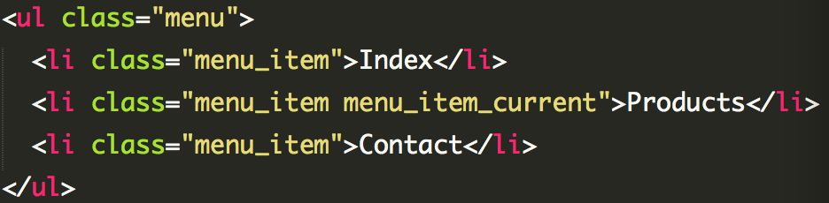

使用两个下划线来分隔块名和元素名：block-name__element_name__

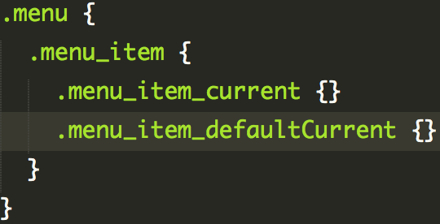

less和sass也可遵循此规范;

## 缩进
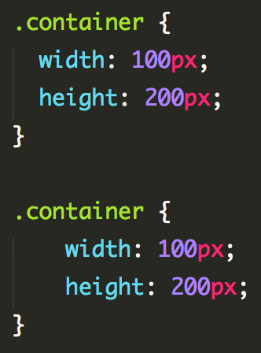
建议2个空格;

## 分号
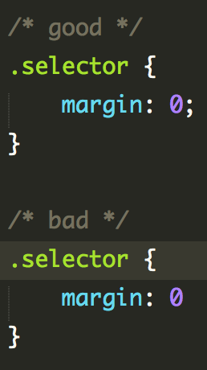
通常在大括号结束前的值可以省略分号，但是这样做会对修改、添加和维护工作带来不必要的失误和麻烦;
没个属性声明末尾都加分号;

## 换行
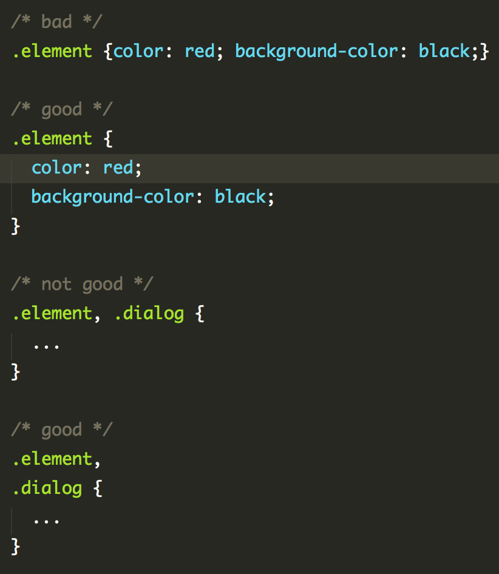
‘{‘ 后和 ‘}’前;
每个属性独占一行;
多个规则的分隔符 ,后;

## 空行
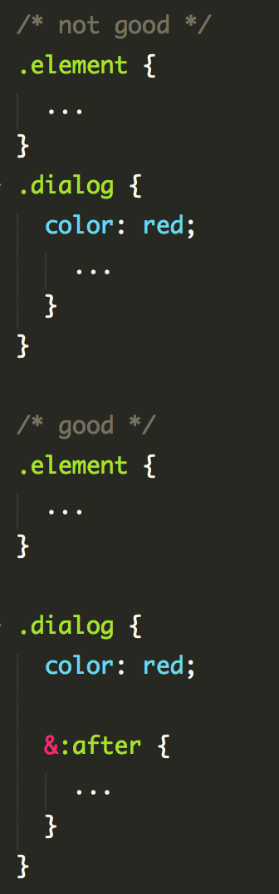
文件最后保留一个空行;
‘}’ 后最好跟一个空行;
属性之间也可加适当的空行分割;

## 注释
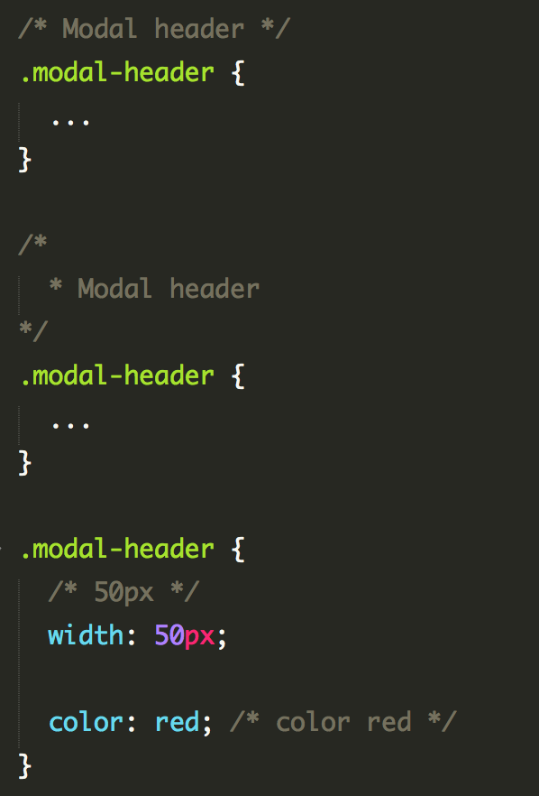
不建议用 // 的方式(less,sass)，统一用 /* */ 的方式;

## 空格
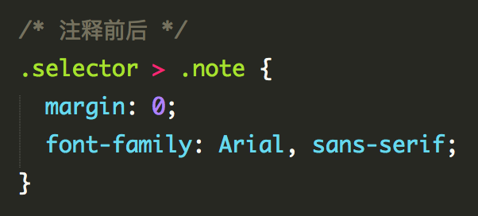
‘{' 前
冒号和属性值之间包含一个空格;
多个属性,句号后跟一个空格;
选择器 '> + ~’ 前后各保留一个空格;
注释 /* 后和 */ 前;

## 行长度
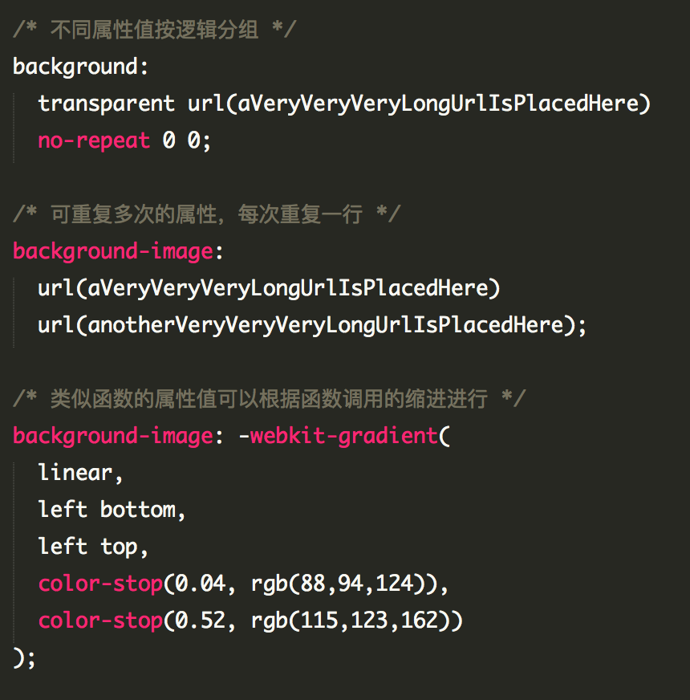
每行不要超过120个字符;

## 引号
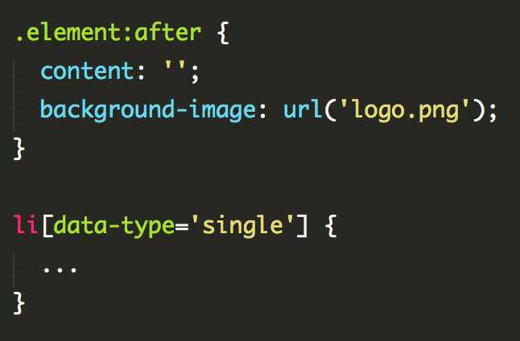
最外层统一使用单引号；
url的内容要用引号；
属性选择器中的属性值需要引号;

## 色值
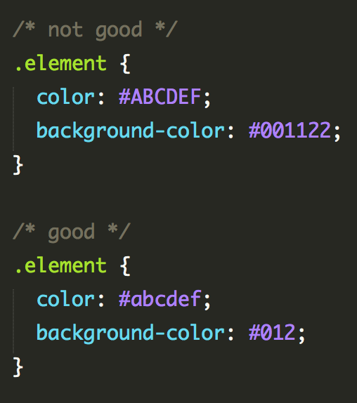
颜色16进制用小写字母,如果一定用了大小，那整个项目保持一致即可;
颜色16进制尽量用简写;
不要使用rgba，除非带alpha的颜色值，可以使用rgba;
不要使用命名色值 如：orange;

## 命名
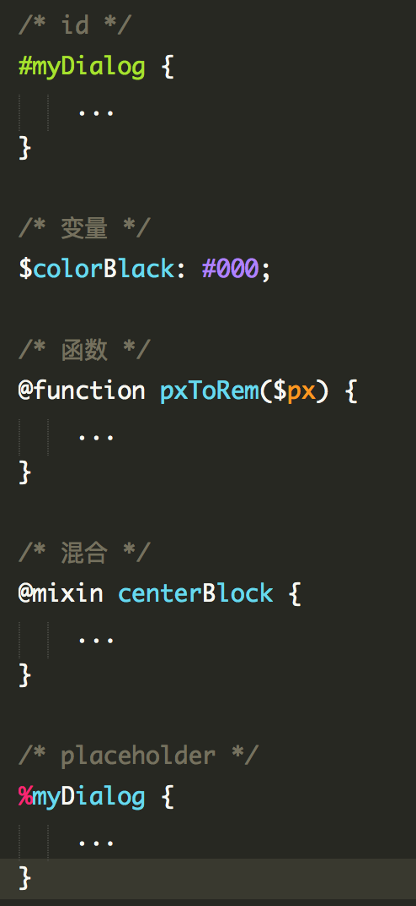
scss，less中的变量、函数、混合采用驼峰式命名

## 属性声明顺序
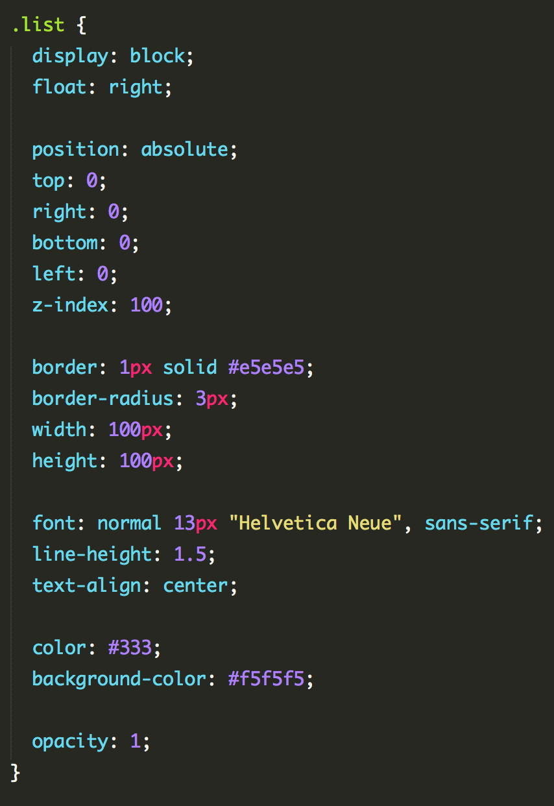

## 嵌套选择器不应大于3级
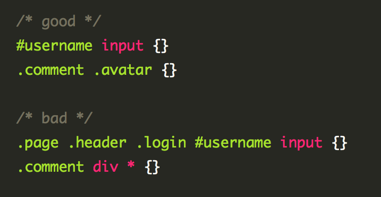
位置靠后的限定条件应尽可能精确

## 属性简写
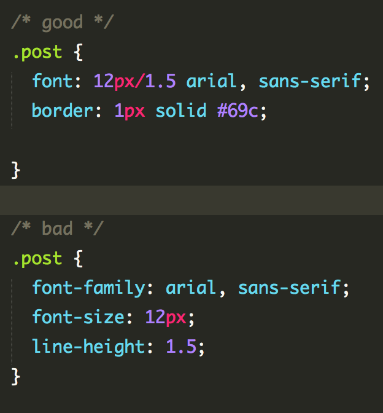

## 字体
字体  操作系统  Family Name
宋体 (中易宋体) Windows SimSun
黑体 (中易黑体) Windows SimHei
微软雅黑  Windows Microsoft YaHei
微软正黑  Windows Microsoft JhengHei
华文黑体  Mac/iOS STHeiti
冬青黑体  Mac/iOS Hiragino Sans GB
文泉驿正黑 Linux WenQuanYi Zen Hei
文泉驿微米黑  Linux WenQuanYi Micro Hei

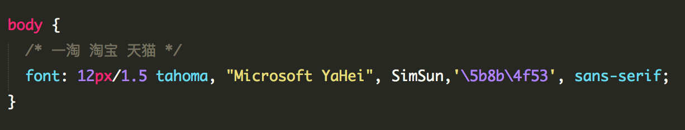
按「英文字体在前、中文字体在后」、「效果佳 (质量高/更能满足需求) 的字体在前、效果一般的字体在后」的顺序编写；
最后必须指定一个通用字体族( serif / sans-serif );

## 杂项
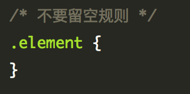

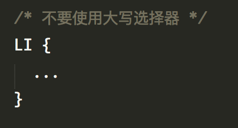

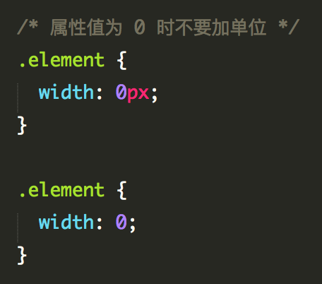

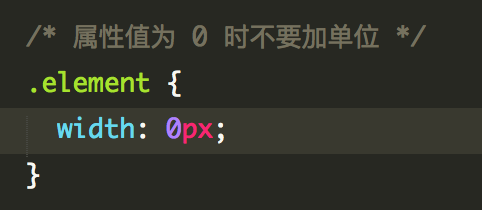

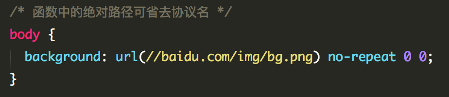

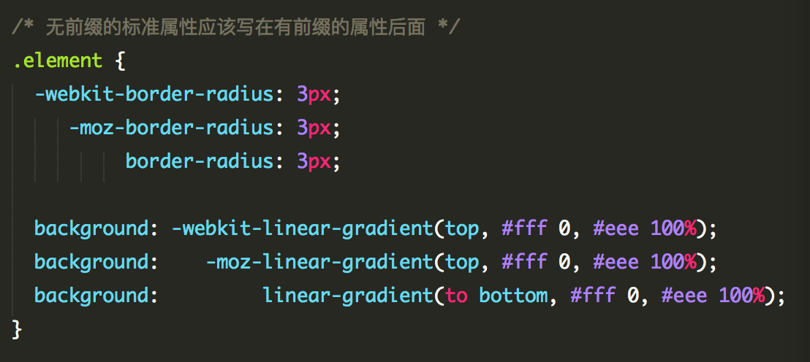

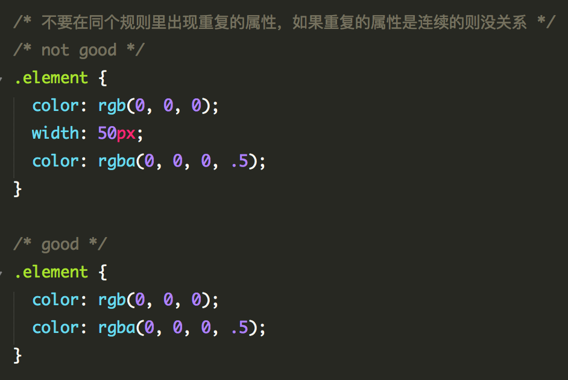

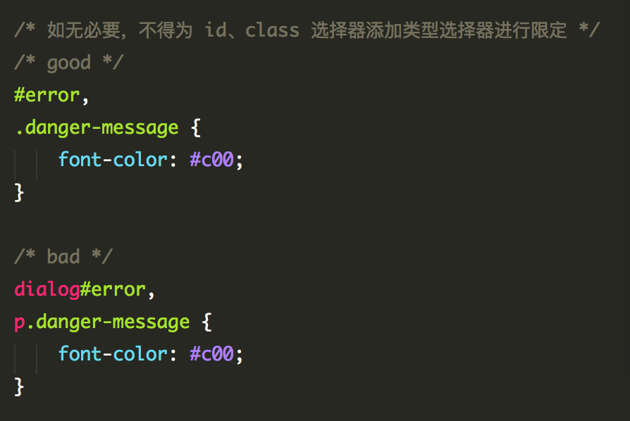

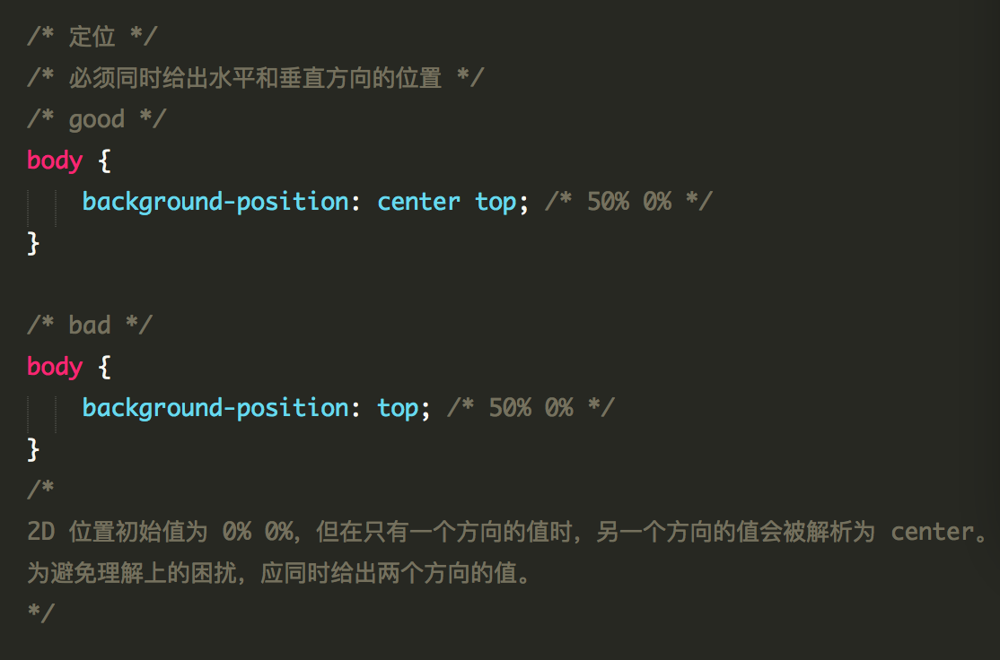

/* 用 border: 0; 代替 border: none */
/* 尽量使用变换位置的方式来规避 z-index，如果一定要用要在可控范围内 */
/* 尽量不用 @import */
/* 尽量不用'*'选择器 */

## Id的命名:

1)页面结构

容器: container
页头：header
内容：content/container
页面主体：main
页尾：footer
导航：nav
侧栏：sidebar
栏目：column
页面外围控制整体佈局宽度：wrapper
左右中：left right center

(2)导航

导航：nav
主导航：mainnav
子导航：subnav
顶导航：topnav
边导航：sidebar
左导航：leftsidebar
右导航：rightsidebar
菜单：menu
子菜单：submenu
标题: title
摘要: summary

(3)功能

标志：logo
广告：banner
登陆：login
登录条：loginbar
注册：register
搜索：search
功能区：shop
标题：title
加入：joinus
状态：status
按钮：btn
滚动：scroll
标籤页：tab
文章列表：list
提示信息：msg
当前的: current
小技巧：tips
图标: icon
注释：note
指南：guild
服务：service
热点：hot
新闻：news
下载：download
投票：vote
合作伙伴：partner
友情链接：link
版权：copyright
注意事项::

1.一律小写;
2.尽量用英文;
3.不加中槓和下划线;
4.尽量不缩写，除非一看就明白的单词。

## CSS样式表文件命名

主要的 master.css
模块 module.css
基本共用 base.css
布局、版面 layout.css
主题 themes.css
专栏 columns.css
文字 font.css
表单 forms.css
补丁 mend.css
打印 print.css

css顺序完整参考
http://rule.h5ds.com/#css-bem

参考
https://github.com/ecomfe/spec
http://taobaofed.org/blog/2017/02/16/a-guide-to-api-design/
https://github.com/aralejs/aralejs.github.io/wiki
https://github.com/airbnb/javascript
