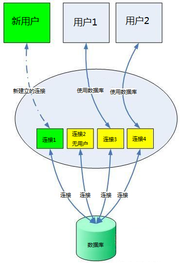

## 引言
今天准备用node链接mysql，查询公司项目的详细信息，第一步把项目列表展示出来即可！
于是简单学下mysql，分享给大家！

## 简介
MySQL是由瑞典的MySQL AB公司开发，后来被甲骨文公司收购。和Oracle一样，MySQL是一个典型的关系型数据库
MySQL作为数据库主要是因为它体积小，速度快，安装完才几百兆，而且核心程序采用多线程编程，线程也是轻量级的进程，不会占用太多的系统资源，因此一般的中小型网站都选择MySQL数据库。
但是也正是由于它的轻量级，因此它也“砍掉”了一些功能，比如存储过程等

## 关系型数据库和非关系型数据库
说到关系型数据库，大家肯定就会想到另一个词与之对应，非关系型数据库，那么这两者有什么样的区别呢？
关系型数据库是指采用了关系模型（指的是二维表格模型）来组织数据的数据库，有稳定的表结构；
而非关系型数据库中的数据没有关系模型，以对象的形式存放到数据库中，对象之间的关系是通过每个对象的属性来决定的，有点类似于一长串json对象。
典型的非关系型数据库有MongoDB和Redis

## 链接 mysql
```js
var mysql = require('mysql');
// 连接数据库的配置
var connection = mysql.createConnection({
  // 主机名称，一般是本机
  host: 'localhost',
  // 数据库的端口号，如果不设置，默认是3306
  port: 3306
  // 创建数据库时设置用户名
  user: 'xyf',
  // 创建数据库时设置的密码
  password: 'xyf',
  // 创建的数据库
  database: 'xyf_db'
});
// 与数据库建立连接
connection.connect();
// 查询数据库
connection.query('SELECT 1 + 1 AS solution', function(err, rows, fields) {
  if (err) throw err;
  console.log('The solution is: ', rows[0].solution);
});
// 关闭连接
connection.end();
```

显示The solution is: 2 说明链接成功，如果不成功，请根据错误提示排错
在查询完数据库后，通过end()函数将连接关闭。
如果连接一直打开，首先会浪费不必要的系统资源
其次，数据库的连接数量有限制，如果达到上限时，会出现后续连接不上报错的情况

官方文档还给出了另外两种建立连接的方式（隐式链接）
```js
var mysql = require('mysql')
var connection = mysql.createConnection(...)
connection.query('SELECT 1 + 1 AS solution', function(err, rows, fields) {
  if (err) throw err
  console.log('The solution is: ', rows[0].solution)
})
connection.end()
```
注意这里没有用connect()函数建立连接，而是直接查询，这时建立连接将会被隐式地调用

## 连接失败处理
一旦连接出现错误将带来连锁的多米诺骨牌效应，查询也将会失败，整个程序也会崩溃，为了避免出现这样的情况，我们将查询和关闭连接放到回调函数中。
```js
var mysql = require('mysql')
var connection = mysql.createConnection(...)
connection.connect(function(err){
  if(err){
    // 连接失败时的错误处理
    console.log(err)
    return
  }
  connection.query('SELECT 1 + 1 AS solution', function(err, rows, fields) {
    if(err){
      // 查询失败时的错误处理
      console.log(err)
      return err
    }
    console.log('The solution is: ', rows[0].solution)
  })
  connection.end()
})
```

## 关闭连接
打开了数据库的连接我们也需要关闭连接，有两种关闭连接的方式，一种就是我们上面用的end()方法来关闭连接，它可以接收一个回调函数
```js
connection.end(function(err) {
  // 这时连接已经被关闭了
});
```

destroy()函数确保了没有更多的时间和回调会触发连接。同时destroy()函数也没有回调函数
```js
connection.destroy()
```

## 数据库连接池
数据库连接池负责分配、管理和释放数据库连接，它允许应用程序重复使用一个现有的数据库连接，而不是再重新建立一个。
这项技术能明显提高对数据库操作的性能。
用一个很生动的例子来形容数据库连接池的工作：以前我们存取钱都需要去银行的柜台交易，银行的柜台数量是有限的，人多的时候还需要排队；
现在我们把钱都存在了支付宝上，每次需要用钱的时候都直接跟支付宝“要”，不需要再跑到银行去了，所有和银行“打交道”的业务都交给了支付宝帮我们来管理


数据库连接池在初始化的时候将一定数量（数量受最小连接数制约）的数据库连接存放到数据库连接池中，
不管这些数据库连接是否被使用，连接池一直要存放这么多的连接数量。
连接池的最大数据库连接数量限制了连接池最多能同时拥有的连接数，如果超过最大连接数时，请求将会被添加到等待队列中去

## 创建数据库连接池
```js
var mysql = require('mysql')
var pool=mysql.createPool({
  host: 'localhost',
  user: 'xyf',
  password: 'xyf',
  port: '3306',
  database: 'xyf_db',
  // 最大连接数，默认为10
  connectionLimit: 10
})
pool.getConnection(function(err,connection){
  if(err){
    console.log(err)
    return
  }
  connection.query('SELECT 1 + 1 AS solution',function(err,result){
    connection.release()
    if(err){
      console.log(err)
      return
    }
    console.log('The solution is: ', result[0].solution)
  })
})
```
首先我们通过createPool()方法创建了一个数据库连接池，它的配置参数和上面的配置基本差不多，只是多了一个最大连接数。
每次我们需要和数据库建立连接的时候不再是直接建立连接，而是去连接池中通过pool.getConnection()方法“捞取”已有的连接。
这个方法有一个回调，数据库连接作为回调参数返回给我们使用。
每次查询完数据库是都要使用release()方法释放数据库连接，这样数据库连接又回到了连接池中。
释放后如果再使用connection将会报错

## 关闭连接池
一般数据库连接池不需要关闭，但是如果使用完连接池需要将所有的连接关闭，我们可以使用pool.end()方法将其关闭
```js
pool.end(function (err) {
  // 所有连接池中的数据库连接将会被关闭
})
```
end()方法提供一个回调方法，以便在所有连接关闭时进行一些操作。
关闭连接池前所有队列中的查询任然会执行完成，所以每次关闭的时间都不一样。
一旦end()方法被调用了，getConnection和其他一些获取连接池中连接的方法不会再被执行

## 模糊查询
SELECT * FROM iw_static_project WHERE name LIKE "%app%"

## 获取时间加日期
select now()
select current_timestamp()
select localtime()
select localtimestamp()

// now() 在执行开始时值就得到了， sysdate() 在函数执行时动态得到值
select sysdate()

// 获取日期
select curdate()

// 获得当前时间
select curtime()

// 因为我国位于东八时区，所以本地时间 = UTC 时间 + 8 小时。UTC 时间在业务涉及多个国家和地区的时候，非常有用。
utc_date(), utc_time(), utc_timestamp()

// 时间戳 Timestamp 函数
current_timestamp, current_timestamp()

// Unix 转换函数
unix_timestamp() // 将具体时间来转换成timestamp
unix_timestamp(1218290027)
from_unixtime('2008-08-08 12:30:00') // 将timestamp来转换成具体时间
from_unixtime(1218169800, '%Y %D %M %h:%i:%s %x')

// 时间戳（timestamp）转换、增、减函数
timestamp(date)                                     -- date to timestamp
timestamp(dt,time)                                  -- dt + time
timestampadd(unit,interval,datetime_expr)           --
timestampdiff(unit,datetime_expr1,datetime_expr2)   --
请看示例部分：
select timestamp('2008-08-08');                         -- 2008-08-08 00:00:00
select timestamp('2008-08-08 08:00:00', '01:01:01');    -- 2008-08-08 09:01:01
select timestamp('2008-08-08 08:00:00', '10 01:01:01'); -- 2008-08-18 09:01:01
select timestampadd(day, 1, '2008-08-08 08:00:00');     -- 2008-08-09 08:00:00
select date_add('2008-08-08 08:00:00', interval 1 day); -- 2008-08-09 08:00:00
MySQL timestampadd() 函数类似于 date_add()。
select timestampdiff(year,'2002-05-01','2001-01-01');                    -- -1
select timestampdiff(day ,'2002-05-01','2001-01-01');                    -- -485
select timestampdiff(hour,'2008-08-08 12:00:00','2008-08-08 00:00:00'); -- -12
select datediff('2008-08-08 12:00:00', '2008-08-01 00:00:00');           -- 7
MySQL timestampdiff() 函数就比 datediff() 功能强多了，datediff() 只能计算两个日期（date）之间相差的天数。


